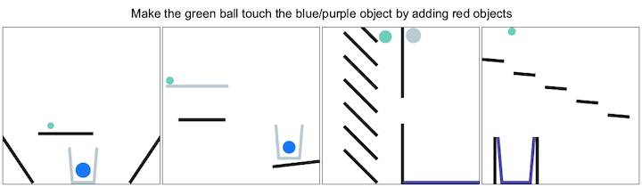
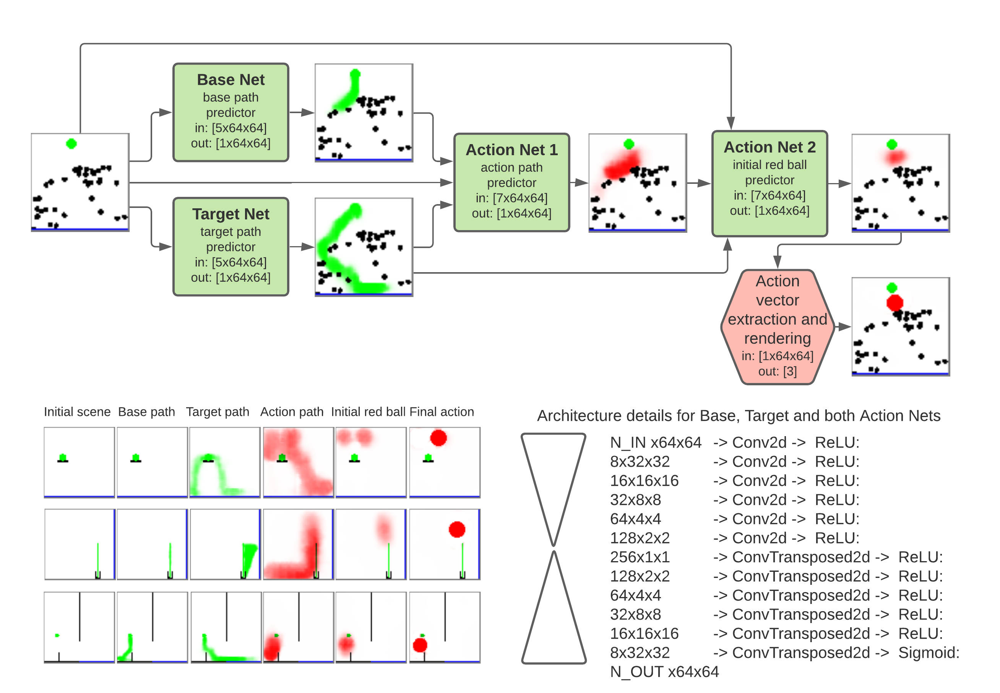
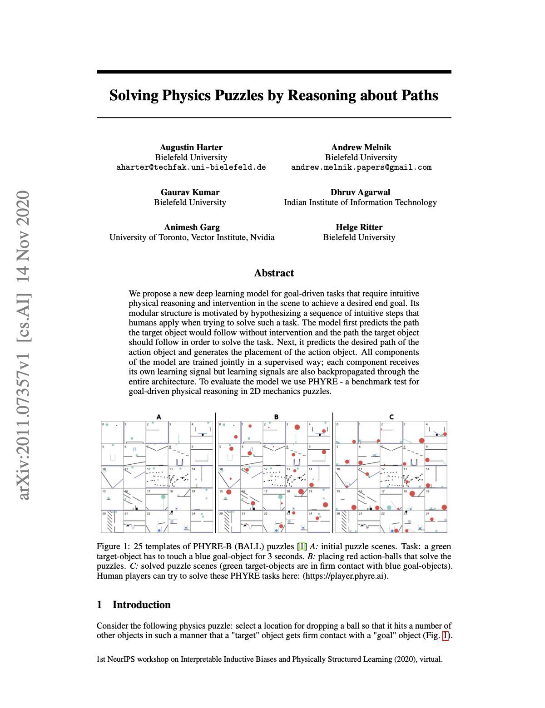

# Solving Physics Puzzles by Reasoning about Paths

[](LICENSE)

[arXiv](https://arxiv.org/abs/2011.07357)

**PHYRE** is a Benchmark For Physical Reasoning



# Abstract

We propose a new deep learning model for goal-driven tasks that require intuitive physical reasoning and intervention in the scene to achieve a desired end goal. Its modular structure is motivated by hypothesizing a sequence of intuitive steps that humans apply when trying to solve such a task. The model first predicts the path the target object would follow without intervention and the path the target object should follow in order to solve the task. Next, it predicts the desired path of the action object and generates the placement of the action object. All components of the model are trained jointly in a supervised way; each component receives its own learning signal but learning signals are also backpropagated through the entire architecture. To evaluate the model we use PHYRE - a benchmark test for goal-driven physical reasoning in 2D mechanics puzzles.

# YouTube

[](https://youtu.be/X30QGeIEXRs)

[NeurIPS 2020 video presentation](https://youtu.be/X30QGeIEXRs)

# Action generation model

<p align="center"></p>

**Top:** Action generation pipeline. NNs modules are highlighted with green rectangles. The task's initial scene is presented to the agent as five bitmap channels; one channel for each object class: Green target-object, blue dynamic goal-object, blue static goal-object, dynamic grey objects, static black objects.  **Bottom left** Model prediction examples. All examples of the generated *final action* in the figure solve the corresponding tasks.  **Bottom right:** Model architecture details: Every Conv2d and ConvTransposed2d Layer has a kernel size of 4x4, stride of 2 and padding of 1.

# Citation

[](https://arxiv.org/abs/2011.07357)

[arXiv](https://arxiv.org/abs/2011.07357)

```bibtex
@article{harter2020solving,
  title={Solving Physics Puzzles by Reasoning about Paths},
  author={Harter, Augustin and Melnik, Andrew and Kumar, Gaurav and Agarwal, Dhruv and Garg, Animesh and Ritter, Helge},
  journal={arXiv preprint arXiv:2011.07357},
  year={2020}
}
```

<!---
How do I get a YouTube video thumbnail from the YouTube API?
https://stackoverflow.com/questions/2068344/how-do-i-get-a-youtube-video-thumbnail-from-the-youtube-api

Markdown Cheatsheet
https://github.com/adam-p/markdown-here/wiki/Markdown-Cheatsheet#youtube-videos
-->
